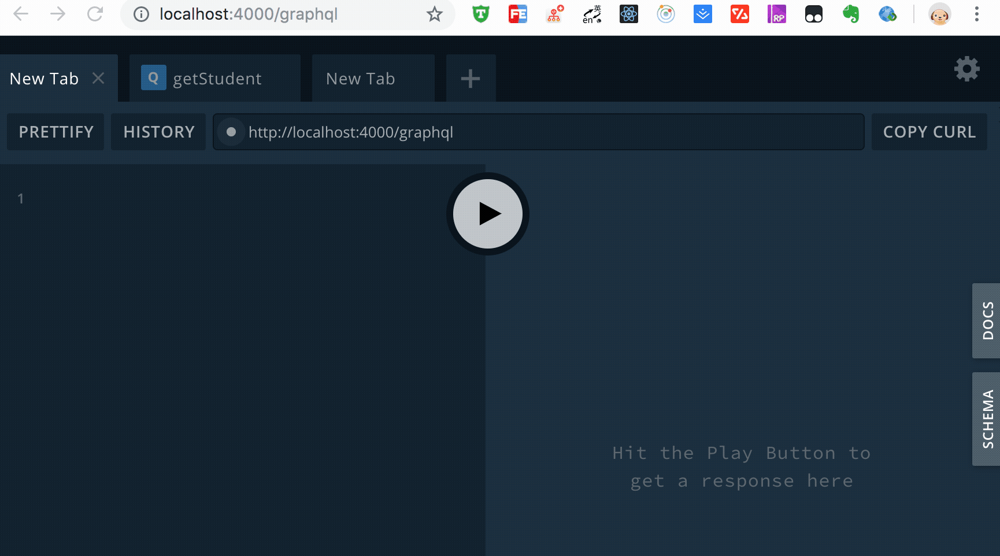
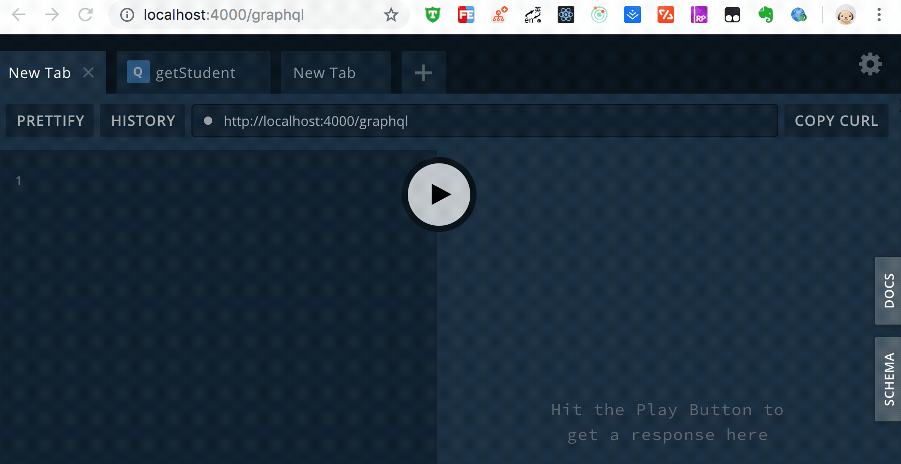
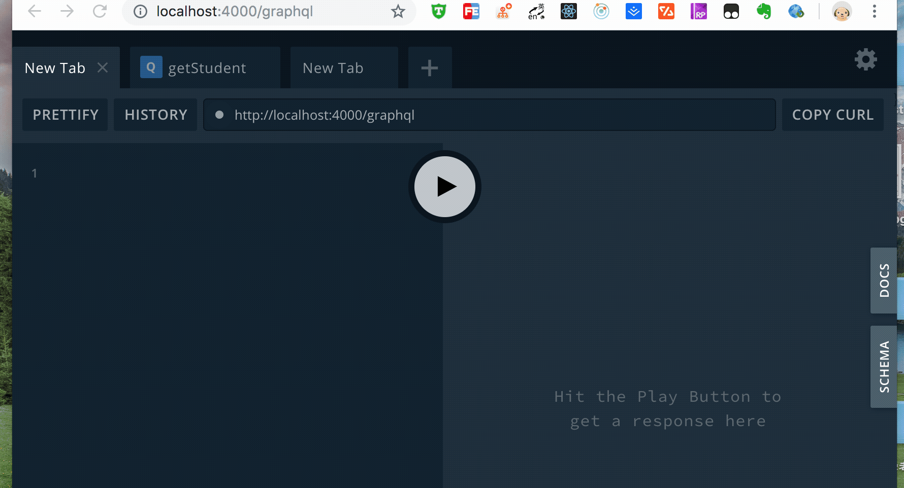
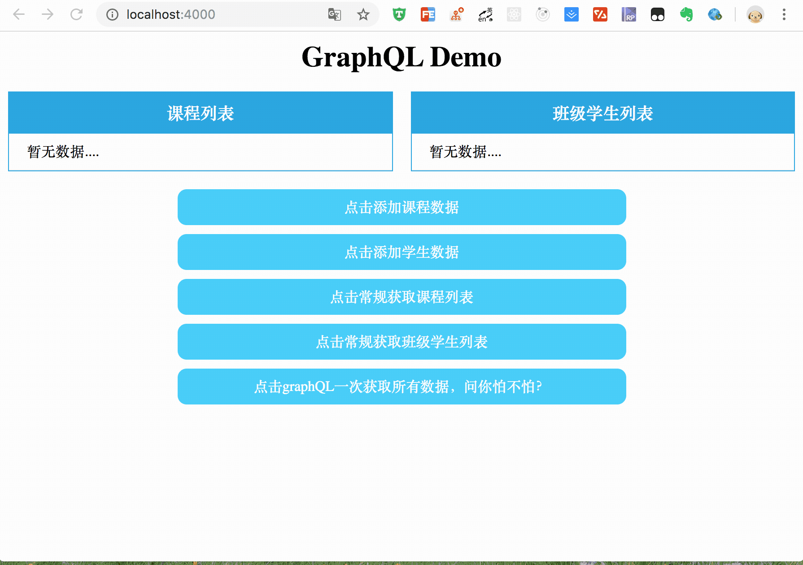

这是利用Koa + GraphQL + Apollo-Server实现的，学生信息增、删、改、查的栗子

本栗子将搭配koa实现一个GraphQL查询的例子，逐步从简单Kao服务到Mongodb的数据插入查询再到GraphQL的使用，
让大家快速看到：

* 搭建Koa搭建一个后台项目
* 后台路由简单处理方式
* 利用Mongoose简单操作Mongodb的增、删、改、查
* 掌握Apollo-Server简单操作数据的增、删、改、查
* 掌握GraphQL的入门姿势

## 项目视图

* query




* addStudent



* addCourse




* FE-demo



## 使用方法

````js
1、git clone https://github.com/naihe138/GraphQL-demo.git

2、npm install

3、node run dev

````
